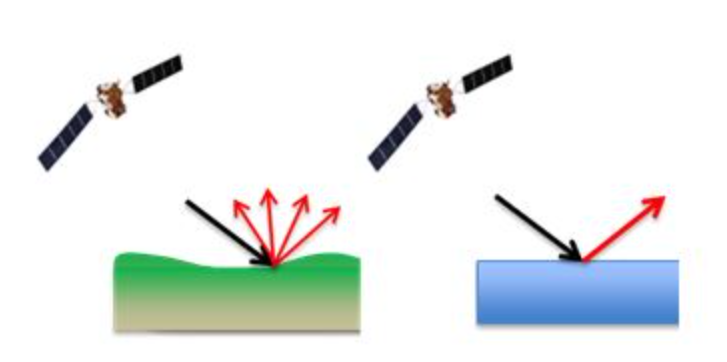
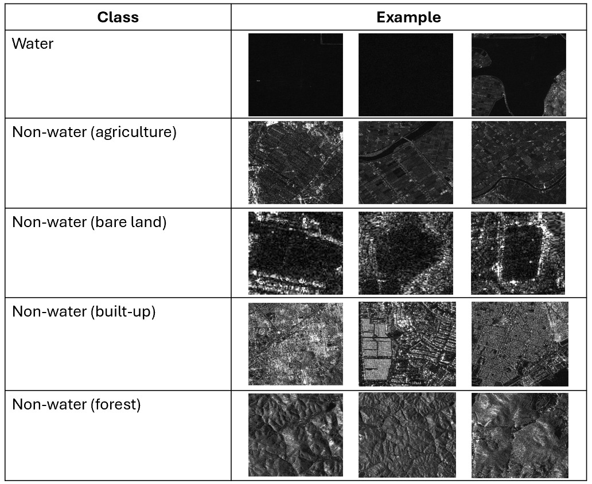
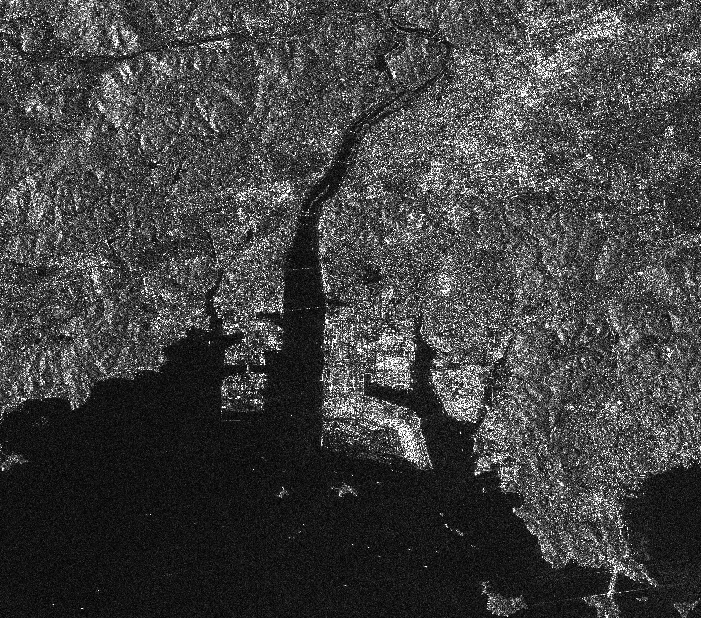

# 8.2 Methods and python coding for classifying water and non-water in SAR observations
This section introduces participants to ...

## Content:
- 8.2.1 Threshold-based classification method (Otsu's method)

## 8.2.1 Threshold-based classification method (Otsu's method)

### 8.2.1.1 Understanding ALOS-2 backscatter for water detection
#### a. [How SAR backscatter values can be used to distinguish between water and non-water?](https://www.gsi.ie/en-ie/programmes-and-projects/groundwater/activities/groundwater-flooding/gwflood-project-2016-2019/Pages/Mapping-methodologies.aspx)

SAR systems emit radar pulses and record the return signal at the satellite. The strength of this signal, also called backscatter. SAR backscatter values can differentiate between water and non-water surfaces based on how each reflects radar signals. Water surfaces typically produce low backscatter due to their smoothness, reflecting radar signals away from the sensor and appearing darker in SAR images with a uniform pattern. In contrast, non-water surfaces like land, vegetation, and urban areas, which are rougher, cause diffuse reflections that result in higher backscatter values, making them appear brighter and more variable in SAR imagery.

Figure 8.2.1.1.1: SAR backscatter between non-water and water

Figure 8.2.1.1.2: An example images showing how water and non-water areas appear in SAR 

Table 8.2.1.1.1: An example images showing how water and non-water areas appear in SAR (ALOS-2 data)

|      Class     |                    Example                    |
|-----------------|----------------------------------------------|
| Water   |   |

Table 8.2.1.1.2: An example limitations of ALOS-2 data (ALOS-2 data)

### 8.2.1.2 Implementing Otsu’s method for image segmentation
#### a. [Otsu's method](https://radiopaedia.org/articles/otsus-method)
Otsu’s method also known as Otsu's threshold algorithm, is an automatic thresholding algorithm used in image processing to separate pixels or voxels into groups based on their values in relation to the image histogram. It finds threshold values that minimize intraclass variance or maximize interclass variance. Many image processing libraries provide built-in implementations of Otsu’s method, and various extensions of it have been applied to radiological images.

#### b. [Understanding Otsu’s Method for Image Segmentation](https://www.baeldung.com/cs/otsu-segmentation#:~:text=Otsu's%20method%20is%20a%20popular,intensity%20values%20of%20its%20pixels.)

Image segmentation is an important step in most computer vision applications. Image segmentation involves dividing an image into multiple regions or segments based on some criteria. In particular, one of the most popular methods for image segmentation is Otsu’s method. This tutorial cover the details of Otsu’s method, its advantages and limitations, and some applications.

Learners wil understand the points below from this content:
1. Introduction
2. Otsu’s Method: an Overview
3. Pseudocode
4. Advantages and Disadvantages of Otsu’s Method
5. Applications of Otsu’s Method
6. Conclusion

#### c. Hands-on guidance on how to implement Otsu’s method in Python to extract water bodies areas
The tutorials below provide the example to Image processing in notebooks, including visualizing the input data, plot histogram, and visualize output after apply Otsu's method.

1. After studying the hands-on below, a learner will understand how to implement Otsu's thresholding method in Python using image processing libraries like skimage. They'll learn to apply automatic thresholding to segment images based on pixel intensity, explore the mathematical principles behind minimizing intraclass variance, and visualize results. The notebook provides practical coding examples, making it easy to follow along and apply Otsu’s method to real-world image data.

- [Hands-on on how to implement Otsu’s method in Python](https://github.com/adfoucart/image-processing-notebooks/blob/main/V26%20-%20Otsu%20threshold.ipynb)

2. The webpage demonstrates Multi-Otsu thresholding, an extension of Otsu’s method used to segment an image into multiple classes based on intensity. The algorithm calculates multiple thresholds to divide pixel values, with the default setting creating three classes. The example uses Python's skimage library to apply Multi-Otsu to an image, showing the original image, histogram with thresholds, and the final segmented output.

- [Multi-Otsu Thresholding](https://scikit-image.org/docs/stable/auto_examples/segmentation/plot_multiotsu.html)

3. After studying the hands-on below, a learner will gain practical experience in implementing image processing techniques, specifically focusing on Otsu's thresholding. They will learn how to load image data (ALOS-2 data), apply automatic thresholding, and segment images based on pixel intensity using Python libraries like skimage. The notebook also offers hands-on examples to understand how to interpret the thresholded results and optimize image segmentation workflows.

However, in this materials we separate the hands-on into 2 cases.

- The area of interest not cover mountain area.

[Hands-on guidance on how to implement Otsu’s method in Python to classify water areas](code/Otsu's_method_to_classify_water_area.ipynb)

- The area of interest is cover mountain area: In mountainous areas, incorporating slope data with Otsu's method to classify water areas is essential due to the complex terrain. 

[Hands-on guidance on how to implement Otsu’s method and slope data in Python to classify water areas](code/Otsu's_method_and_slope_data_to_classify_water_area.ipynb)

### 8.2.1.3 (Optional) Accuracy assessment and confusion matrix

[Accuracy assessment](https://desktop.arcgis.com/en/arcmap/latest/manage-data/raster-and-images/accuracy-assessment-for-image-classification.htm)

Accuracy assessment is a key step in classification projects, involving the comparison of a classified image with reliable ground truth data, which can be gathered in the field or derived from high-resolution imagery, classified maps, or GIS layers. While field collection is time-consuming and costly, the common method for accuracy assessment involves generating random points from the ground truth and comparing them to the classified data in a confusion matrix. This process, often requiring multiple classification methods or limited ground truth data, can be streamlined using tools like Create Accuracy Assessment Points, Update Accuracy Assessment Points, and Compute Confusion Matrix.

- [Confusion matrix](https://www.ibm.com/topics/confusion-matrix)

A confusion matrix is a tool for evaluating the performance of classification models by comparing predicted values against actual values. It displays the number of true instances of each class versus the predicted class instances. This matrix helps in calculating other performance metrics like precision and recall.

Confusion matrices can be used with any classifier algorithm, such as Naïve Bayes, logistic regression models, decision trees, and so forth. Because of their wide applicability in data science and machine learning models, many packages and libraries come preloaded with functions for creating confusion matrices, such scikit-learn’s sklearn.metrics module for Python.

- [Hands-on for Accuracy assessment](code/Compute_Accuracy.ipynb)