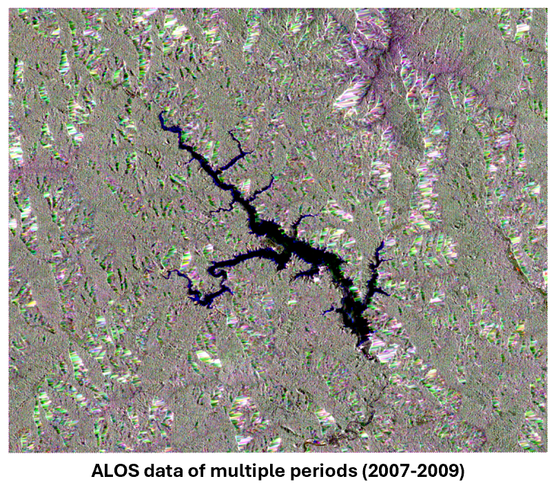
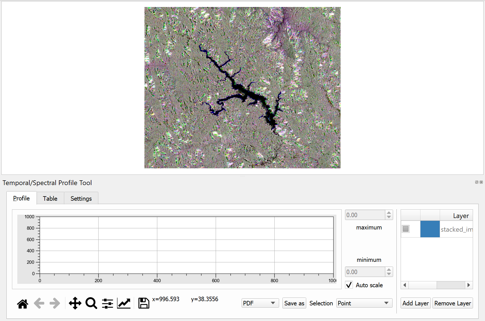
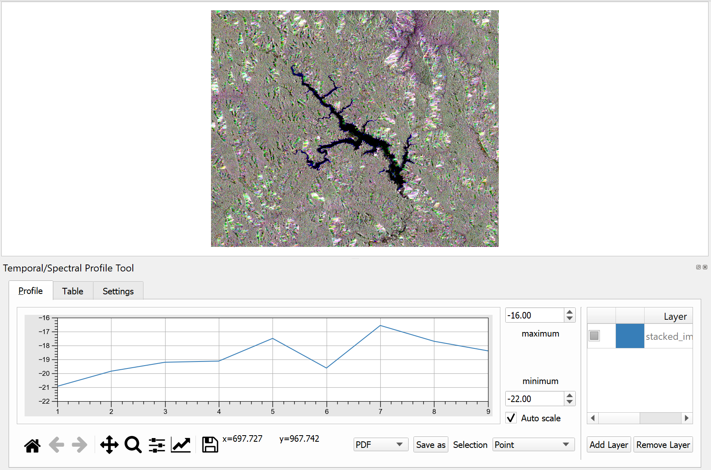
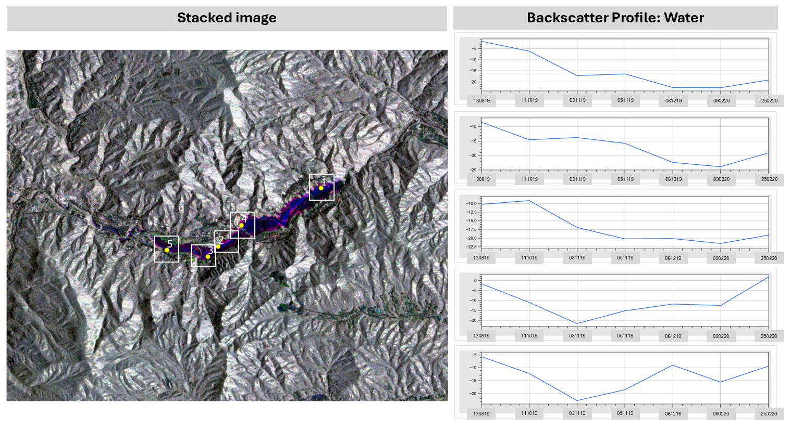

# 8.3 Methods and python coding for change detection with time-series observations
This section introduces participants to ...

## Content:
- 8.3.1 Provide hands-on guidance on
    - How to prepare time-series data for analysis
    - How to visualize the time-series results for specific change locations using graphs in Python
- 8.3.2 Explain how to interpret the results

### 8.3.1 Provide hands-on guidance on
#### a. (Basic) [What Is Time-Series Analysis?](https://www.timescale.com/blog/time-series-analysis-what-is-it-how-to-use-it/)

Time-series analysis is a statistical technique used to examine data collected over time, identifying patterns, trends, seasonality, and irregularities. By employing mathematical tools, it helps uncover the structure of the data and provides insights into not only what occurred, but also when and why events happened.

#### b. How to prepare time-series data for analysis

**1. Clip image** for region of interest.

**2. Calibrate the data** 
Apply Radiometric calibration factors to convert digital number to backscatter value: Radiometric calibration is crucial for converting ALOS-2 SAR data into physically meaningful values (like backscatter) that accurately represent the reflectivity of the Earth's surface. It ensures that the data is corrected for sensor biases, comparable across different sensors or acquisition times, and suitable for detailed analysis like environmental monitoring, land use classification, and disaster management.

**3. Noise Reduction using a Lee Filter**
The Lee Speckle Filter is a technique used to reduce speckle noise in SAR (Synthetic Aperture Radar) imagery. Speckle noise is a granular noise that naturally occurs in SAR images due to the coherent nature of radar systems, where each pixel contains multiple scatterers contributing to the same radar return signal. This noise degrades the quality of the image and makes interpretation or further analysis difficult. Applying the Lee Speckle Filter on ALOS PALSAR-2 data helps in:
 - Noise Reduction: It reduces speckle noise while preserving important image details such as edges.
 - Improved Interpretation: Cleaned images allow for better visual interpretation and feature extraction.
 - Better Analysis: For quantitative analysis like classification, change detection, or biomass estimation, reduced speckle helps improve the accuracy.

 **4. Layer stacking**
 Layer stacking is used to combine multiple images from different time points or sources into a single multi-band image, which is particularly useful for time-series analysis. By stacking the images into multiple bands, each band represents a snapshot of the same area but at a different time or captured under different conditions. This enables simultaneous analysis of temporal changes in the same spatial location, allowing for better comparison and identification of trends, such as vegetation growth, water body fluctuations, or urban expansion. Stacking ensures that the images are aligned and in a common format, simplifying pixel-based computations like classification, change detection, or statistical analysis across time.

  - Hands-on for prepare time-series data for analysis

#### c. How to visualize the time-series results for specific change locations using graphs in QGIS
To visualize and interpret the results of waterbody extent change from ALOS-2 SAR data in QGIS, you can follow these steps. The goal is to visualize specific change locations between different periods (2007-2009), and interpret the waterbody extent transitions.

**Load Time-Series Raster Data**
 - Load the raster layers representing the time series for the area you want to analyze (e.g., stacked image).
 - Make sure each layer represents a different time step (e.g., yearly or monthly data).

์NOTE:
 - In this case, we have stack the 7 images in different time into 1 image with 7 bands, which consists of: 13 August 2019, 1 October 2019, 3 November 2019, 5 November 2019, 6 December 2019, 9 February 2020, and 25 February 2020, respectively.
 - To composite the image, this case use RGB composite as R: Band 7 (25 February 2020), G: Band 4 (5 November 2019), B: Band 1 (13 August 2019) because when using these 3 bands in the composite image, the changing areas can be clearly seen.

**The Temporal/Spectral Profile Tool Tool Plugin**
The Temporal/Spectral Profile Tool in QGIS is useful for analyzing changes over time in multispectral satellite imagery. It allows you to visualize and interpret how the spectral values (or any raster values) at a specific location change over time. This is particularly helpful when dealing with time series data, such as Landsat or Sentinel imagery, and you want to monitor changes like land cover, vegetation health, or environmental phenomena.

 - Install the Temporal/Spectral Profile Plugin
 - Open QGIS and navigate to the Plugins menu.
 - Select Manage and Install Plugins.
 - Search for “Temporal/Spectral Profile” and install the plugin.

**Activate the Temporal/Spectral Profile Tool**
 - Once installed, go to the Plugins menu and select Temporal/Spectral Profile.
 - This will open the Temporal/Spectral Profile window where you can view the graphs.

 

**Select the Time Series Layers**:
 - In the Temporal/Spectral Profile window, click the "Add" button to load the time series of rasters.
 - Choose the layers that correspond to the temporal data (e.g., Value for different dates or years).
 - These layers must have temporal information in their metadata or file names, which the tool uses to organize them chronologically.

**Pick a Location for Analysis**
 - In the QGIS canvas, use the tool to select a point of interest (POI) where you want to analyze the changes over time.
 - You can click directly on the map or manually input the coordinates.

**View the Temporal Profile**
 - The Temporal/Spectral Profile tool will generate a graph that shows the change in raster values over time for the selected location.
 - The X-axis represents time (e.g., date or year), and the Y-axis shows the raster values (e.g., back scatter value).

### 8.3.2 Explain how to interpret the results

Yamba Dam, completed in October 2019 and officially opened in April 2020, experienced significant water level changes in November 2019, before its official opening, due to the heavy rainfall from [Typhoon Hagibis](https://ja.wikipedia.org/wiki/%E4%BB%A4%E5%92%8C%E5%85%83%E5%B9%B4%E6%9D%B1%E6%97%A5%E6%9C%AC%E5%8F%B0%E9%A2%A8) in October 2019. The typhoon brought record-breaking rains, causing water levels to rise in the dam and its surrounding areas. Sample locations 1-3, which changed from non-water to water in November 2019, remained stable with no significant changes thereafter. However, locations 4-5, at the outer edges of the water area, continued to show some fluctuations as the water levels in the dam later receded.