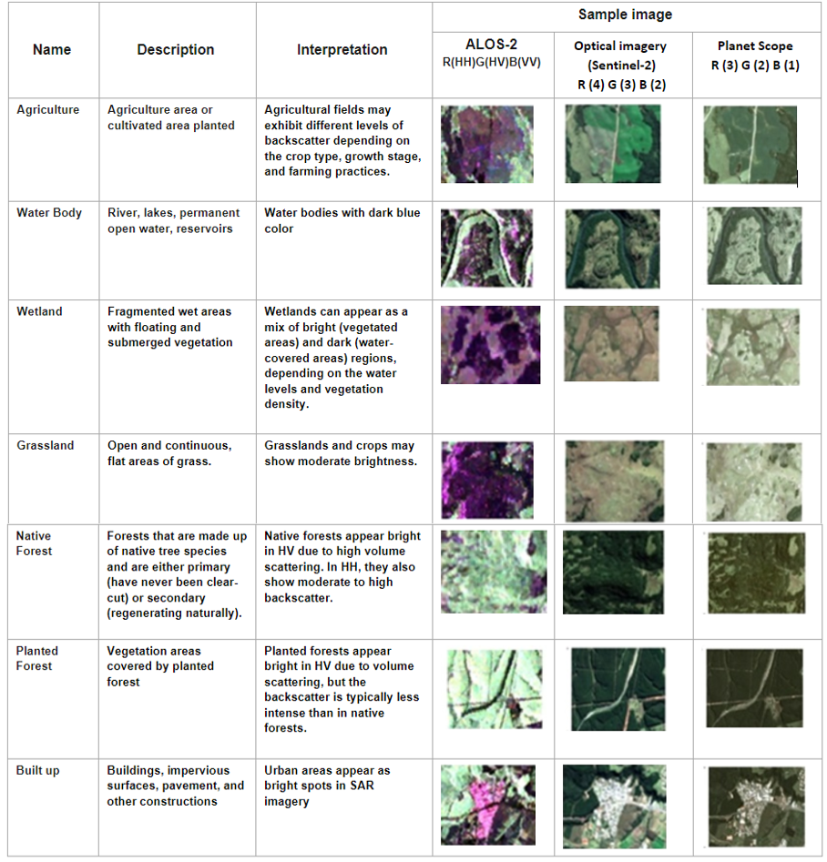
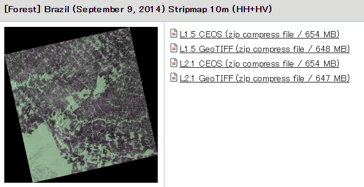
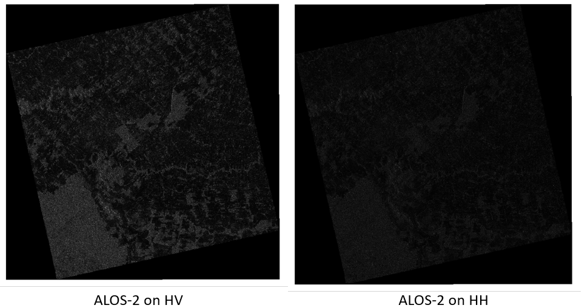
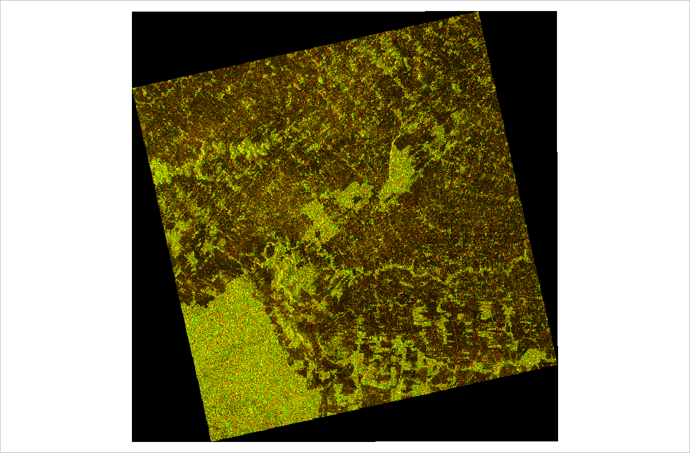
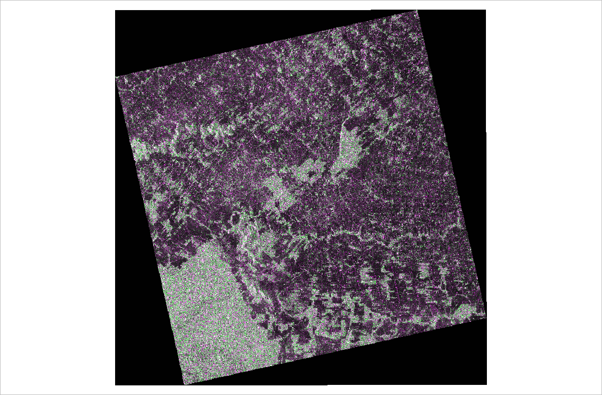
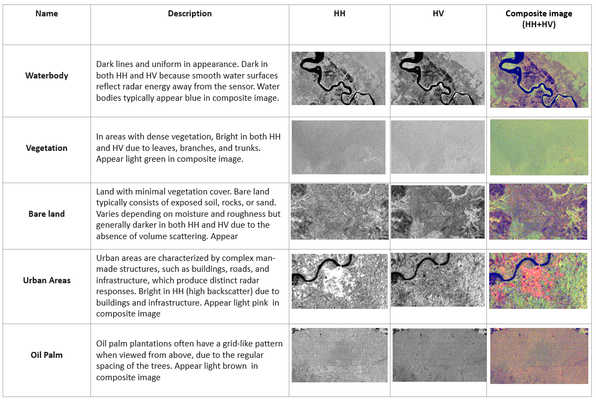

# 9.2 Interpretation of forest and oil palm areas (comparison with optical observations)

-  Provide visual examples of forest and oil palm areas in ALOS-2 and optical imagery 
-  Provide hands-on guidance on interpreting ALOS-2 data with guided examples
-  Provide hands-on guidance on visual comparison and interpretation between ALOS-2 and optical data

## Provide visual examples of forest and oil palm areas in ALOS-2 and optical imagery 

### a. [Benefits of Combining ALOS/PALSAR-2 and Sentinel-2A Data in the Classification of Land Cover Classes in the Santa Catarina Southern Plateau](https://www.mdpi.com/2072-4292/13/2/229#)

 To interpret the existing features and sample collection, images of the constellation PlanetScope acquired on the same date. Both PALSAR-2 and PlanetScope were acquired on February 23, 2018. A clear sky image from the SENTINEL-2A sensor with an imaging date of June 09, 2018, was also used. It shows few changes in land cover compared to the image of the same sensor of February 23, 2018, thus facilitating its visual interpretation and selecting both training and validation datasets for the statistical assessment and classification procedures. 

### b. [Mapping Oil Palm Plantations in Cameroon Using PALSAR 50-m Orthorectified Mosaic Images](https://www.mdpi.com/2072-4292/7/2/1206)

In this paper, three classification algorithms (Support Vector Machine (SVM), Decision Tree and K-Means) were explored to map oil palm plantations in Cameroon, using PALSAR 50 m Orthorectified Mosaic images and differently sized training samples.

For large-scale mapping of oil palm plantations, the Decision Tree algorithm outperformed both SVM and K-Means in terms of speed and performance. In addition, the decision threshold values of Decision Tree for a large training sample size agrees with the results from previous studies, which implies the possible universality of the decision threshold.

The workflow for oil palm mapping. Multiple classification approaches were carried out and their accuracies were assessed. We evaluated an unsupervised method (K-Means classification), a decision tree method (QUEST), and a machine learning method (SVM). SVM and K-Means algorithms were implemented with ENVI 5.0 software. The QUEST algorithm was implemented with RuleGenTool embedded into ENVI 5.0. 

## Provide hands-on guidance on interpreting ALOS-2 data with guided examples

Interpreting forest and oil palm using ALOS-2 data involves advanced techniques in SAR (Synthetic Aperture Radar) analysis, which can be backed by various research studies and methods. 

Below is a step-by-step guide on how to interpret ALOS-2 data in QGIS.

### 1. Downloading ALOS-2 Data
Before starting in QGIS, download the necessary ALOS-2 data. Some platforms where you can access ALOS-2 data include:

JAXA (Japan Aerospace Exploration Agency): JAXA ALOS-2 Portal
ASF DAAC (Alaska Satellite Facility): ASF Data Portal
You can download ALOS-2 data in GeoTIFF or HDF5 formats, which are compatible with QGIS.
https://www.eorc.jaxa.jp/ALOS/en/alos-2/datause/a2_sample_e.htm

### 2. Loading ALOS-2 Data into QGIS
Install QGIS: If you don't already have QGIS installed, you can download it from QGIS.org.

- Open QGIS and create a new project.
- Load the Data:
- Go to the Layer menu and select Add Layer > Add Raster Layer.
- Browse to the location of the ALOS-2 SAR data file (GeoTIFF or HDF5) and click Open.

After loading the data, right-click the layer in the Layers Panel and select Properties.
Under the Metadata tab, you can view important information such as resolution, projection, and bands of the dataset.

### 3.Create a Virtual Raster (Optional)

If the HH and HV bands are separate images, create a virtual raster to work with them as a single dataset:
Go to Raster > Miscellaneous > Build Virtual Raster (Catalog).
In the dialog, add the HH and HV rasters, and check the option to “Separate” the bands. This will create a virtual raster combining both bands.

### 4.Creating RGB color composite image
Here's a step-by-step guide on how to create an RGB color composite of ALOS-2 imagery using QGIS, followed by visualizing and interpreting the image.

- Load HH and HV Bands into QGIS
Open QGIS and load the HH and HV bands into the project. Each polarization (HH and HV) should be a separate GeoTIFF file or raster layer.
Use Layer > Add Layer > Add Raster Layer or drag and drop the GeoTIFF files into QGIS.

- Set Up a Multiband Composite
- Go to the Layer Properties of the virtual raster or the individual band raster (whichever you prefer to use).
- In the Symbology tab, choose Multiband color from the Render type dropdown.
- Assign the HH and HV bands to different color channels to create a composite image:
For example:
Red channel: HH (Horizontal-Horizontal polarization)
Green channel: HV (Horizontal-Vertical polarization)
Blue channel: You can either assign the HV again for more contrast, or leave it as No band for a two-band composite (Red and Green).

### 4.Interpreting ALOS-2 data with guided examples

- Water Bodies: Dark lines and uniform in appearance. Dark in both HH and HV because smooth water surfaces reflect radar energy away from the sensor. Water bodies typically appear blue in composite image.

- Vegetation: In areas with dense vegetation, Bright in both HH and HV due to leaves, branches, and trunks. Appear light green in composite image.

- Bare Soil/Open Areas: Land with minimal vegetation cover. Bare land typically consists of exposed soil, rocks, or sand. Varies depending on moisture and roughness but generally darker in both HH and HV due to the absence of volume scattering. Appear

- Urban Areas: Urban areas are characterized by complex man-made structures, such as buildings, roads, and infrastructure, which produce distinct radar responses. Bright in HH (high backscatter) due to buildings and infrastructure. Appear light pink  in composite image

- Oil palm : Oil palm plantations often have a grid-like pattern when viewed from above, due to the regular spacing of the trees. Appear light brown  in composite image

## Provide hands-on guidance on visual comparison and interpretation between ALOS-2 and optical data

Here’s a step-by-step guide on visual comparison and interpretation between ALOS-2 and optical data in QGIS.

### 1. Loading Data into QGIS:

- ALOS-2 Data (HH, HV)
    - Import the ALOS-2 HH and HV polarization bands as separate raster layers.
- Optical Data (e.g., Sentinel-2 or Landsat)
    - Import the RGB bands (for natural color composite) and other bands (such as near-infrared) for vegetation and land cover analysis.

### 2. Basic Differences in Visualization:
- ALOS-2 SAR Data
    - SAR data (HH and HV) appears in grayscale by default.
    - HH band captures surface scattering and highlights urban areas, soil, or rough surfaces.
    - HV band captures volume scattering, which is useful for analyzing vegetation and differentiating it from bare soil.
    - Bright areas indicate strong backscatter (e.g., urban areas, rough surfaces), while dark areas indicate low backscatter (e.g., water bodies).
- Optical Data
    - RGB composites display natural colors. Vegetation appears green, water bodies blue, and urban areas gray.
    - Other band combinations, like the NDVI (Normalized Difference Vegetation Index), highlight vegetation health, where healthy vegetation appears bright, and non-vegetated surfaces appear dark.

### 3. Interpretation: Key Differences:
- Water Bodies

    - In ALOS-2 SAR: Water bodies typically appear dark in both HH and HV polarizations due to the smoothness of water surfaces, which reflect radar signals away from the sensor.
    - In Optical Data: Water bodies appear blue (in RGB composites) and may appear darker in near-infrared bands due to absorption of NIR radiation by water.

- Vegetation

    - In ALOS-2 SAR: Vegetation shows up with high HV backscatter due to volume scattering from leaves and branches. Dense forests will be bright in HV and moderately bright in HH.
    - In Optical Data: Vegetation appears green in RGB and bright in near-infrared due to strong reflection of NIR radiation by healthy plants.

- Bare land

    - In ALOS-2 SAR: Bare land appear dark in both HH and HV polarizations with moderate to smooth texture.
    - In Optical Data: Bare land appearing in shades of brown or gray.

- Urban Areas:
    - In ALOS-2 SAR: Urban areas show up as bright regions in both HH and HV bands due to the strong reflection from man-made structures.
    - In Optical Data: Urban areas appear gray or white in RGB composites and are generally dark in near-infrared bands.

