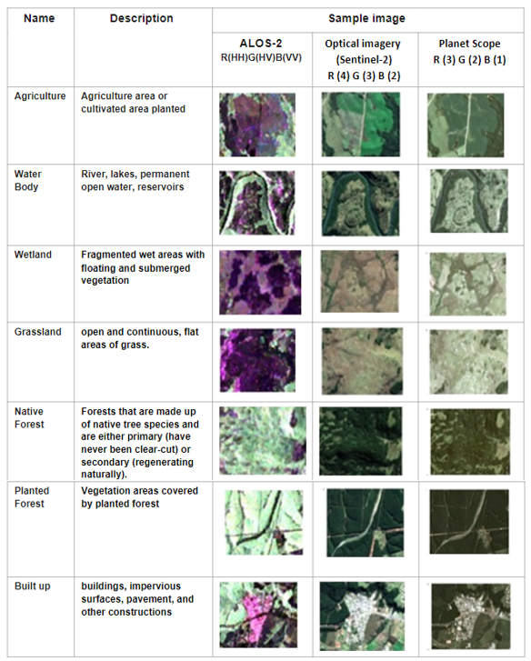

# 9.2 Interpretation of forest and oil palm areas (comparison with optical observations)

-  Provide visual examples of forest and oil palm areas in ALOS-2 and optical imagery 
-  Provide hands-on guidance on interpreting ALOS-2 data with guided examples
-  Provide hands-on guidance on visual comparison and interpretation between ALOS-2 and optical data

## Provide visual examples of forest and oil palm areas in ALOS-2 and optical imagery 

### a. [Benefits of Combining ALOS/PALSAR-2 and Sentinel-2A Data in the Classification of Land Cover Classes in the Santa Catarina Southern Plateau](https://www.mdpi.com/2072-4292/13/2/229#)

 To interpret the existing features and sample collection, images of the constellation PlanetScope acquired on the same date. Both PALSAR-2 and PlanetScope were acquired on February 23, 2018. A clear sky image from the SENTINEL-2A sensor with an imaging date of June 09, 2018, was also used. It shows few changes in land cover compared to the image of the same sensor of February 23, 2018, thus facilitating its visual interpretation and selecting both training and validation datasets for the statistical assessment and classification procedures. 

### b. [Mapping Oil Palm Plantations in Cameroon Using PALSAR 50-m Orthorectified Mosaic Images](https://www.mdpi.com/2072-4292/7/2/1206)

In this paper, three classification algorithms (Support Vector Machine (SVM), Decision Tree and K-Means) were explored to map oil palm plantations in Cameroon, using PALSAR 50 m Orthorectified Mosaic images and differently sized training samples.

For large-scale mapping of oil palm plantations, the Decision Tree algorithm outperformed both SVM and K-Means in terms of speed and performance. In addition, the decision threshold values of Decision Tree for a large training sample size agrees with the results from previous studies, which implies the possible universality of the decision threshold.

The workflow for oil palm mapping. Multiple classification approaches were carried out and their accuracies were assessed. We evaluated an unsupervised method (K-Means classification), a decision tree method (QUEST), and a machine learning method (SVM). SVM and K-Means algorithms were implemented with ENVI 5.0 software. The QUEST algorithm was implemented with RuleGenTool embedded into ENVI 5.0. 

## Provide hands-on guidance on interpreting ALOS-2 data with guided examples

Interpreting forest and oil palm using ALOS-2 data involves advanced techniques in SAR (Synthetic Aperture Radar) analysis, which can be backed by various research studies and methods. 

Below is a step-by-step guide on how to interpret ALOS-2 data in QGIS.

### 1. Downloading ALOS-2 Data
Before starting in QGIS, download the necessary ALOS-2 data. Some platforms where you can access ALOS-2 data include:

JAXA (Japan Aerospace Exploration Agency): JAXA ALOS-2 Portal
ASF DAAC (Alaska Satellite Facility): ASF Data Portal
You can download ALOS-2 data in GeoTIFF or HDF5 formats, which are compatible with QGIS.
https://www.eorc.jaxa.jp/ALOS/en/alos-2/datause/a2_sample_e.htm

### 2. Loading ALOS-2 Data into QGIS
Install QGIS: If you don't already have QGIS installed, you can download it from QGIS.org.

- Open QGIS and create a new project.
- Load the Data:
- Go to the Layer menu and select Add Layer > Add Raster Layer.
- Browse to the location of the ALOS-2 SAR data file (GeoTIFF or HDF5) and click Open.

After loading the data, right-click the layer in the Layers Panel and select Properties.
Under the Metadata tab, you can view important information such as resolution, projection, and bands of the dataset.

### 3.Create a Virtual Raster (Optional)

If the HH and HV bands are separate images, create a virtual raster to work with them as a single dataset:
Go to Raster > Miscellaneous > Build Virtual Raster (Catalog).
In the dialog, add the HH and HV rasters, and check the option to “Separate” the bands. This will create a virtual raster combining both bands.

### 4.Creating RGB color composite image
Here's a step-by-step guide on how to create an RGB color composite of ALOS-2 imagery using QGIS, followed by visualizing and interpreting the image.

- Load HH and HV Bands into QGIS
Open QGIS and load the HH and HV bands into the project. Each polarization (HH and HV) should be a separate GeoTIFF file or raster layer.
Use Layer > Add Layer > Add Raster Layer or drag and drop the GeoTIFF files into QGIS.

- Set Up a Multiband Composite
- Go to the Layer Properties of the virtual raster or the individual band raster (whichever you prefer to use).
- In the Symbology tab, choose Multiband color from the Render type dropdown.
- Assign the HH and HV bands to different color channels to create a composite image:
For example:
Red channel: HH (Horizontal-Horizontal polarization)
Green channel: HV (Horizontal-Vertical polarization)
Blue channel: You can either assign the HV again for more contrast, or leave it as No band for a two-band composite (Red and Green).

## Provide hands-on guidance on visual comparison and interpretation between ALOS-2 and optical data

______________________________________________________________________________________________________________________________________________________________

### Polarimetric SAR Analysis
Polarimetric Decomposition Techniques: Polarimetric SAR (POLSAR) data from ALOS-2 can be decomposed using methods like the Freeman-Durden and Yamaguchi decomposition. These techniques help distinguish different scattering mechanisms, such as surface scattering, double-bounce scattering, and volume scattering, which are key to differentiating forests and oil palm plantations.

Reference: Lee, J.-S., & Pottier, E. (2009). Polarimetric Radar Imaging: From Basics to Applications. CRC Press.

### Backscatter Analysis
Analysis of Backscatter Coefficient (σ⁰): By examining the radar backscatter at different polarizations (HH, HV, VH, VV), different land cover types can be identified. Forests generally have higher HV backscatter due to complex canopy structures, while oil palm plantations might show distinctive patterns due to regular tree arrangements.

Reference: Henderson, F. M., & Lewis, A. J. (1998). Principles and Applications of Imaging Radar. In Manual of Remote Sensing (3rd ed.). American Society for Photogrammetry and Remote Sensing.

### Time-Series Analysis
Temporal Monitoring: Time-series analysis of ALOS-2 data can reveal patterns and changes in land cover over time. Regular monitoring can help detect deforestation or the growth of oil palm plantations.

Reference: Reiche, J., et al. (2015). "Combining SAR and optical satellite image time series for forest disturbance mapping." Remote Sensing of Environment, 156, 276-293.

### Machine Learning Classification
Supervised Learning: Supervised classification techniques like Random Forest or Support Vector Machines can be applied to ALOS-2 data to classify land cover. These methods require training datasets that represent the classes of interest, such as forest and oil palm.

Reference: Miettinen, J., Stibig, H.-J., & Achard, F. (2014). "Remote sensing of forest degradation in Southeast Asia—Aiming for a regional mapping approach." Forest Ecology and Management, 315, 10-18.

### Interferometric SAR (InSAR)
Vegetation Height Estimation: InSAR techniques can be used to estimate the height of vegetation, which can help differentiate between tall forest trees and shorter oil palm trees.

Reference: Lavalle, M., et al. (2012). "Tropical-forest biomass estimation by means of polarimetric SAR, interferometric SAR, and lidar sensors." IEEE Transactions on Geoscience and Remote Sensing, 50(4), 1216-1225.

### Combination with Optical Data
Data Fusion: Combining SAR data from ALOS-2 with optical data (e.g., from Landsat or Sentinel-2) can significantly improve land cover classification accuracy.

Reference: Dong, J., et al. (2012). "A comparison of multisensor data fusion methods for extracting oil palm information." IEEE Journal of Selected Topics in Applied Earth Observations and Remote Sensing, 5(1), 160-170.

#### a. (Basic) [Global Forest/non forest map 2007-2015 - 25m, 100m, 1km (PALSAR-2/PALSAR - JAXA)](https://datacore-gn.unepgrid.ch/geonetwork/srv/api/records/de7eb6de-81bf-4ce9-ae4f-4148aac95f4a)

The global forest/non-forest map (FNF) is generated by classifying the backscattering intensity values in the global 25m resolution PALSAR-2/PALSAR mosaic so that strong and low backscatter in HV-polarization are classified "forest" (colored in green) and "non-forest" (colored in yellow), respectively. Here, "forest" is defined as the natural forest with the area larger than 0.5ha and forest cover over 90%, as same to the FAO definition. Since the radar backscatter from the forest depends on the region (climate zone), the classification of Forest/Non-forest is conducted by using the region dependent threshold of backscatter. The classification accuracy is more than 84% according to the comparison with reference data such as in-situ photos and high-resolution optical satellite images

#### c. (Basic)) [Mapping oil palm plantation expansion in Malaysia over the past decade (2007–2016) using ALOS-1/2 PALSAR-1/2 data](https://www.tandfonline.com/doi/full/10.1080/01431161.2019.1580824)

 In this study, oil palm mapping in Malaysia over the past decade (2007–2016) was produced annually, using Advanced Land Observing Satellite (ALOS)-1 Phased Array Type L-band Synthetic Aperture Radar (PALSAR)-1 (2007–2010) images and ALOS-2 PALSAR-2 (2015 and 2016) images at 100 m resolution with maximum likelihood classifier-based supervised classification. 

Two independent verification systems (testing samples and Malaysian Palm Oil Board statistics) were used to evaluate the mapping accuracy. The average overall accuracy for the six years was 94.62% and the accuracy of oil palm mapping was greater than 83%. The results show the dynamics of oil palm distribution from 2007 to 2016. Two approaches (i.e. pixel counting (PC) and error matrix-based model-assisted (EM)) were used to estimate the oil palm area from the maps.

#### d. (Basic) [Mapping forest in the southern Great Plains with ALOS-2 PALSAR-2 and Landsat 7/8 data](https://www.sciencedirect.com/science/article/pii/S0303243421002853)

This study aims to map forest, especially evergreen forest (above 2 m in height) in the SGP for the time period of 2015–2017. Annual mosaic data of HH and HV polarization backscattering (25 m) from Phased Arrayed L-band Synthetic Aperture Radar-2 (PALSAR-2) aboard Advanced Land Observing Satellite-2 (ALOS-2), along with their difference (HH-HV) and ratio (HH/HV) were utilized. With the four bands (HH, HV, difference, ratio) of 2017, decision rules of forest were developed based on 30 randomly selected forest plots (as of 2017) across the study area. 

## 9.2.2 Visual comparison between ALOS-2 and optical imagery 

To conduct a visual comparison between ALOS-2 (Synthetic Aperture Radar or SAR) imagery and optical imagery for analyzing land surface and land cover, it's essential to understand the unique characteristics of each type of data and how they can be used together to provide complementary insights. Below is a detailed explanation, including references to relevant literature.

### 1. Understanding ALOS-2 SAR Imagery

SAR Characteristics: ALOS-2 (Advanced Land Observing Satellite-2) uses L-band SAR, which transmits microwave signals that penetrate through clouds and vegetation canopies, making it useful for observing surface features in all weather conditions, day or night. SAR is sensitive to surface roughness, structure, and moisture content, providing valuable information about the physical properties of the Earth's surface.

- Surface Texture and Structure: SAR imagery is particularly effective at detecting surface roughness and structural features, such as urban areas, roads, and forests. Urban areas typically appear bright in SAR imagery due to strong backscatter from buildings and other structures.
- Moisture Content: SAR can detect variations in moisture content, which is useful for monitoring wetlands, soil moisture, and flood conditions.
Vegetation Structure: The interaction of SAR signals with vegetation can provide insights into canopy structure, biomass, and forest health.
Reference:

Ulaby, F. T., Moore, R. K., & Fung, A. K. (1986). Microwave Remote Sensing: Active and Passive. Volume III: From Theory to Applications. Artech House. This comprehensive work discusses SAR's capabilities in detail.

### 2. Understanding Optical Imagery

Optical Characteristics: Optical imagery, captured by satellites such as Sentinel-2 or Landsat, records reflected sunlight in various spectral bands (e.g., visible, near-infrared, shortwave infrared). This type of imagery is ideal for identifying land cover types, vegetation health, and surface conditions based on their spectral signatures.

- Spectral Reflectance: Different land cover types, such as water, vegetation, and urban areas, have distinct spectral reflectance properties, making them easily distinguishable in optical imagery.
- Vegetation Health: Indices like NDVI (Normalized Difference Vegetation Index) derived from optical data are widely used to assess vegetation health and biomass.
- Seasonal Changes: Optical imagery is sensitive to seasonal variations, allowing for the monitoring of crop cycles, forest phenology, and other temporal changes.
Reference:

Lillesand, T., Kiefer, R. W., & Chipman, J. (2015). Remote Sensing and Image Interpretation. John Wiley & Sons. This book provides a thorough overview of optical remote sensing techniques.

### 3. Visual Comparison of Land Surface Features

- Urban Areas
ALOS-2 SAR: Urban structures (buildings, roads) often appear bright due to strong backscatter from surfaces that reflect radar signals directly back to the sensor.
Optical Imagery: Urban areas are easily identifiable by their distinct geometric patterns and colors, often showing as grey or white in true-color images.
- Water Bodies
ALOS-2 SAR: Water typically appears dark because it absorbs radar signals and reflects very little back to the sensor.
Optical Imagery: Water bodies are clearly visible in optical images, usually in shades of blue or black, depending on the water depth and clarity.
- Vegetation
ALOS-2 SAR: Forested areas may appear with varying brightness depending on the density and structure of the canopy. Dense forests can have a high volume scattering signature.
Optical Imagery: Vegetation is usually green in true-color images, and healthy vegetation is often bright in the near-infrared band due to high reflectance.

### 4.Comparison of Land Cover Types
- Forests:
ALOS-2 SAR: Forests are identifiable by their complex scattering patterns, which differ from those of agricultural fields or grasslands. SAR is also useful for detecting deforestation or changes in biomass over time.
Optical Imagery: Optical images highlight the extent and type of vegetation. Different types of forests (e.g., deciduous vs. evergreen) can be distinguished by their color and seasonal changes.
- Agricultural Fields:
ALOS-2 SAR: Fields often show regular patterns in SAR imagery, with variations depending on the crop type and growth stage.
Optical Imagery: Crop types can be differentiated based on their spectral signatures, especially in the near-infrared band. Crop health and stages can also be monitored.
- Wetlands:
ALOS-2 SAR: SAR is particularly effective in wetland areas where surface moisture and vegetation structure are critical. It can differentiate between open water, flooded vegetation, and dry land.
Optical Imagery: Wetlands can be identified by their mixed spectral signatures of water and vegetation, which vary seasonally.

Reference:

Ulaby, F. T., Moore, R. K., & Fung, A. K. (1986). Microwave Remote Sensing: Active and Passive. Volume III: From Theory to Applications. Artech House. This comprehensive work discusses SAR's capabilities in detail

Lillesand, T., Kiefer, R. W., & Chipman, J. (2015). Remote Sensing and Image Interpretation. John Wiley & Sons. This book provides a thorough overview of optical remote sensing techniques.

## (Advance) [The Potential Scattering Model for Oil Palm Phenology Based on Spaceborne X-, C-, and L-Band Polarimetric SAR Imaging](https://www.researchgate.net/publication/349905644_The_Potential_Scattering_Model_for_Oil_Palm_Phenology_Based_on_Spaceborne_X-_C-_and_L-Band_Polarimetric_SAR_Imaging)

Information about oil palm phenology is required for oil palm plantation management, but using spaceborne polarimetric radar imagery remains challenging. However, spaceborne polarimetric radar on X-, C-, and L-band is promising on structure vegetation and cloud area. This study investigates the scattering model of oil palm phenology based on spaceborne X-, C-, and L-band polarimetric Synthetic Aperture Radar (SAR) imaging. The X-, C-, and L-band polarimetric SAR are derived from spaceborne of TerraSAR-X, Sentinel-1A, and ALOS PALSAR 2.

The methodology includes data collection,preprocessing, radiometric calibration, speckle filtering, ter-rain correction, extracting scattering value, and developmentscattering model based on spaceborne X-, C-, and L-bandpolarimetric SAR 

## (Advance) [Benefits of Combining ALOS/PALSAR-2 and Sentinel-2A Data in the Classification of Land Cover Classes in the Santa Catarina Southern Plateau](https://www.mdpi.com/2072-4292/13/2/229#)

This study’s main goal was to characterize the polarimetric attributes of the experimental quad-polarization acquisition mode of the Advanced Land Observing Satellite/Phased Array type L-band Synthetic Aperture Radar (ALOS/PALSAR-2) for mapping seven land cover classes. 

The polarimetric attributes were evaluated alone and combined with SENTINEL-2A using a supervised classification method based on the Support Vector Machine (SVM) algorithm. 

