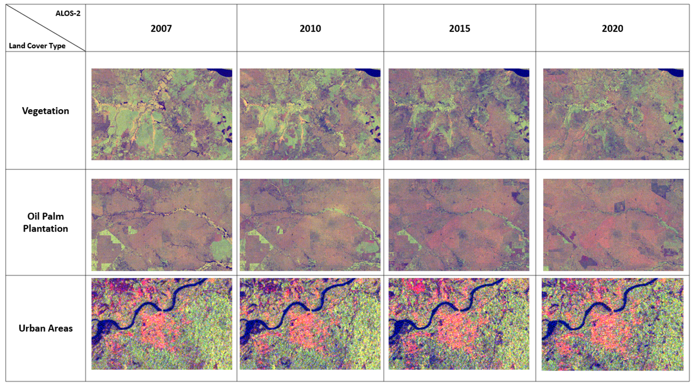
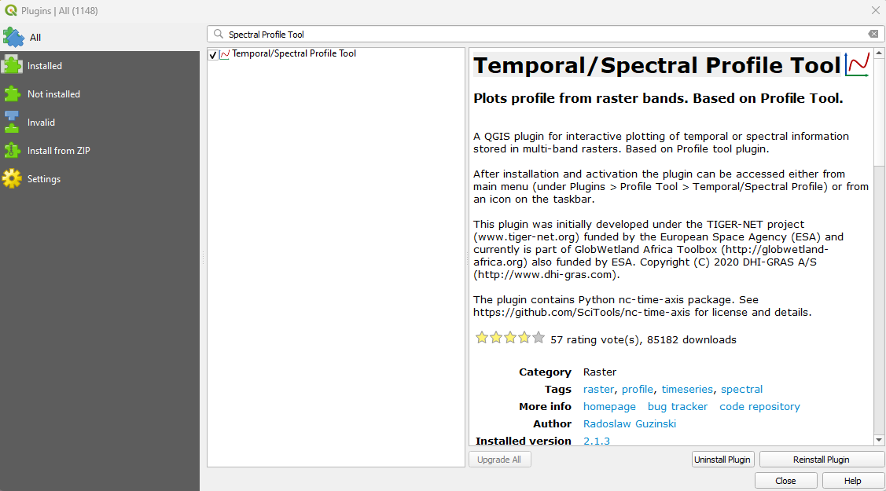
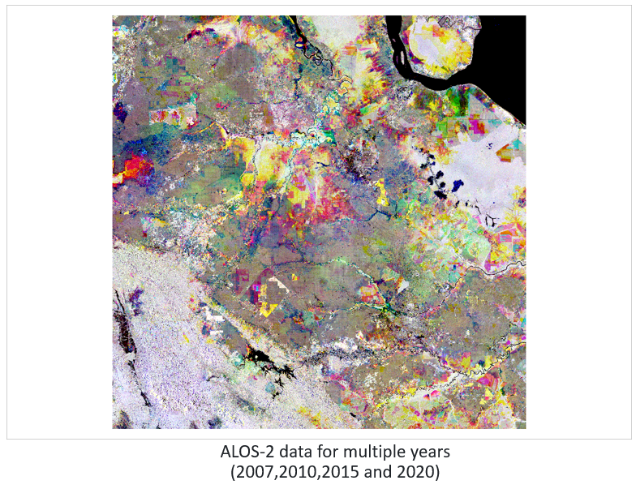
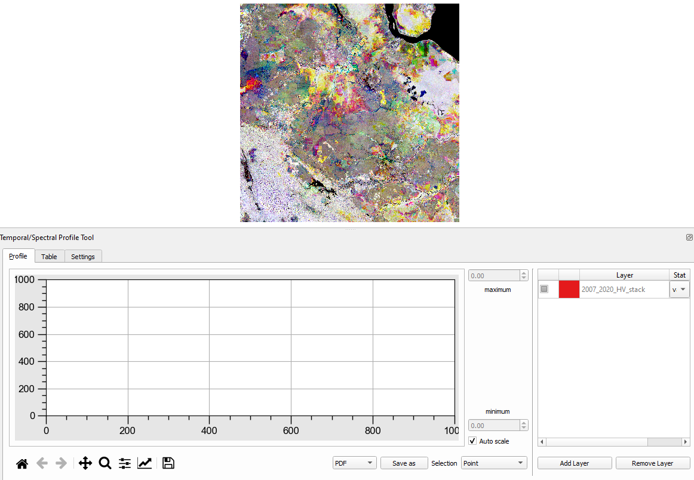
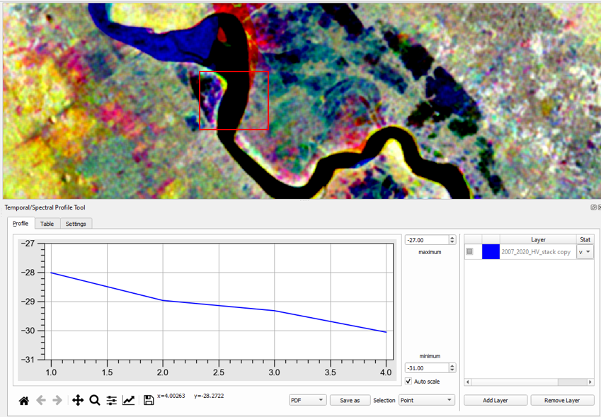

# 9.3 Analysis time-series observation on forest and oil palm area

- Provide hands-on guidance on:
    - How to prepare time-series observations
    - How to visualize and interpret the results for specific change locations

## How to prepare time-series observations

The comparison of ALOS-2 SAR imagery between 2007 and 2020 for detecting oil palm plantations and deforestation can reveal significant changes in land cover. Using SAR (Synthetic Aperture Radar) data, like that from ALOS-2, helps to detect changes in vegetation structure, deforestation, and land-use conversion.

#### Oil Palm Plantations
A major cause of deforestation, can be distinguished in SAR imagery due to their structured planting patterns.

#### Deforestation
Deforestation results in the removal of dense vegetation, which is converted to agricultural land, such as oil palm plantations.

## How to visualize and interpret the results for specific change locations

To visualize and interpret the results of land cover change from ALOS-2 SAR data in QGIS, you can follow these steps. 
The goal is to visualize specific change locations (e.g., waterbody, vegetation, bare land, built-up, oil palm plantation) between different periods (2007, 2011, 2015, 2019), and interpret the land cover transitions.

### The Temporal/Spectral Profile Tool Tool Plugin 
The Temporal/Spectral Profile Tool in QGIS is useful for analyzing changes over time in multispectral satellite imagery. It allows you to visualize and interpret how the spectral values (or any raster values) at a specific location change over time. This is particularly helpful when dealing with time series data, such as Landsat or Sentinel imagery, and you want to monitor changes like land cover,  vegetation health, or environmental phenomena.

Install the Temporal/Spectral Profile Plugin

- Open QGIS and navigate to the Plugins menu.
- Select Manage and Install Plugins.
- Search for “Temporal/Spectral Profile” and install the plugin.

Load Time-Series Raster Data

- Load the raster layers representing the time series for the area you want to analyze (e.g., ALOS-2 data for multiple years).
- Make sure each layer represents a different time step (e.g., yearly or monthly data).

Activate the Temporal/Spectral Profile Tool

- Once installed, go to the Plugins menu and select Temporal/Spectral Profile.
- This will open the Temporal/Spectral Profile window where you can view the graphs.

Select the Time Series Layers:

- In the Temporal/Spectral Profile window, click the "Add" button to load the time series of rasters.
- Choose the layers that correspond to the temporal data (e.g., Value for different dates or years).
- These layers must have temporal information in their metadata or file names, which the tool uses to organize them chronologically.

Pick a Location for Analysis

- In the QGIS canvas, use the tool to select a point of interest (POI) where you want to analyze the changes over time.
- You can click directly on the map or manually input the coordinates.

View the Temporal Profile

- The Temporal/Spectral Profile tool will generate a graph that shows the change in raster values (e.g., NDVI, surface temperature) over time for the selected location.
- The X-axis represents time (e.g., date or year), and the Y-axis shows the raster values (e.g., back scatter value).

Interpret the Results

- Increasing Trends: A gradual increase in values over time may indicate positive growth or improvements in vegetation health (in the case of NDVI or other indices).
- Decreasing Trends: A downward trend could suggest deforestation, degradation, or loss of vegetation.
- Seasonal Variability: If you're looking at short-term time series (e.g., monthly data), you might observe seasonal patterns in vegetation or land cover.
- Anomalies: Look for sudden peaks or drops in the profile, which might indicate specific events like forest fires, floods, or human interventions.

Comparing Multiple Locations

- You can select multiple locations to compare how different areas have evolved over time.
- The tool allows you to compare profiles from multiple points to determine how different environmental factors or human activities affect various regions.