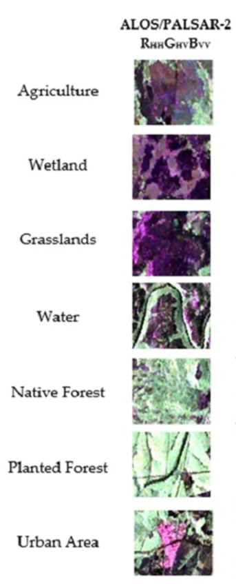

# 10.2 Image processing for color composite (RGB) using ALOS-2
This section introduces participants to .......

## Content:
- 10.2.1 Understanding color composite (RGB)
- 10.2.2 Creating RGB color composite image

## 10.2.1 Understanding color composite (RGB)

### a. [Colour composites](https://eo.belspo.be/en/colour-composites)

You wil learn the points below from this content:
1. **Understanding Colour Composites:** Learn how digital images, especially from remote sensing, use colour channels (red, green, and blue) to represent different parts of the electromagnetic spectrum.
2. **False Colour Composites:** Explore how false colour images are created by pairing display colours (RGB) with non-visible spectral bands, such as infrared, to visualize data not detectable by the human eye.
3. **Analytical Use of Colours:** Understand how the human eye's ability to distinguish colours, shapes, and sizes helps in analyzing multi-component data in remote sensing.
4. **Vegetation and Infrared Analysis:** Learn the advantages of false colour infrared composites for analyzing vegetation, where healthy vegetation appears bright red due to its strong near-infrared reflection.
5. **Distinguishing Water and Mineral Surfaces:** Recognize how water and mineral surfaces appear in false colour composites, with water absorbing light and appearing dark, while mineral surfaces vary from blue to white.
6. **Pseudocolour Images:** Understand the difference between colour composites and pseudocolour images, the latter being used to enhance the interpretation of grayscale, monospectral images by assigning colours to grayscale values.

### b. [7 Applications of SAR](https://dragonflyaerospace.com/seven-applications-of-sar/)
This content shows the SAR's ability to provide detailed, real-time data across a wide range of applications making it a critical tool for Earth observation and decision-making in many fields.
1. **All-Weather, Day-Night Operation:** SAR provides continuous Earth observation regardless of weather conditions or lighting, making it invaluable for various monitoring and surveillance tasks.
2. **Versatile Frequency Bands:** SAR operates on multiple frequency bands (X-band, C-band, L-band), each suited for different applications like high-resolution imaging (X-band) and penetration through vegetation or clouds (L-band).
3. **Environmental Monitoring:** SAR plays a key role in tracking deforestation, land cover changes, and the effects of climate change, as well as monitoring glaciers, ice thickness, and polar regions.
4. **Disaster Management:** SAR is crucial for rapid and accurate damage assessment during disasters (earthquakes, floods, landslides), helping coordinate emergency responses and develop mitigation strategies.
5. **Precision Agriculture:** SAR aids farmers by monitoring crop health, estimating yields, and detecting plant diseases, promoting sustainable agriculture and enhancing food security.
6. **Defence and Security:** Its ability to function in all conditions makes SAR essential for surveillance, reconnaissance, and military operations, providing valuable intelligence on ground movements and hidden infrastructure.
7. **Oceanography and Maritime Monitoring:** SAR assists in monitoring ocean currents, sea surface winds, and maritime activities, as well as detecting illegal fishing and supporting marine navigation.
8. **Urban Planning and Infrastructure:** SAR helps in urban development planning by detecting subsidence and monitoring structural health, contributing to the maintenance of critical infrastructure.
9. **InSAR for Deformation Monitoring:** Interferometric SAR (InSAR) enables precise detection of ground subsidence and deformation, essential for monitoring geological processes and the stability of infrastructure like dams and bridges.

### c. [ALOS User Handbook](https://www.eorc.jaxa.jp/ALOS/en/doc/alos_userhb_en.pdf)

This article present the false colour composite where the co-polarisation (HH) band is displayed in the red channel, the cross-polarisation band (HV) in the green and the (HH-HV) difference in the blue channel. With the HH banc sensitive to direct and specular backscatter and the HV band to volume scattering, forest appears green, clear cut areas dark purple, open water black, and flooded vegetation light violet.

Forest change monitoring is a key application of PALSAR, focusing on identifying and tracking human-induced and natural disturbances in global land cover. Regular monitoring is essential, especially in threatened areas like forests and wetlands, as it provides crucial data on where and when changes occur. Multi-temporal SAR color composites are an effective tool for disturbance mapping, offering clear insights into both spatial and temporal changes.

Wetlands monitoring using L-band SAR, like PALSAR and JERS-1, is essential for mapping spatio-temporal inundation patterns, particularly under forest canopies, which optical sensors or shorter wavelength SARs cannot detect. The long wavelength L-band signals can penetrate forest canopies and interact with the ground, enabling the detection of flooding through "double-bounce" reflections between tree trunks and the water surface. Flooded areas reflect a strong signal, appearing bright in SAR imagery, while open water or non-flooded areas show weaker returns, making L-band SAR a powerful tool for detecting forest inundation.

### d. [ALOS-2 (Advanced Land Observing Satellite-2) / Daichi-2](https://www.eoportal.org/satellite-missions/alos-2#mission-status)

This article present the colour composite in the image represents HH polarisation in red, HV polarisation in green, and HH/HV in blue. In this image, black or dark blue roughly show water or bare land, green shows the vegetation-covered areas, and bright green or purple show the urban areas.

### e. [Combining ALOS-2 Bands to Create an RGB Composite]()

To create an RGB composite from ALOS-2 SAR data, you need multiple ALOS-2 images or polarization channels (e.g., HH, HV, or different temporal acquisitions). The process involves assigning these ALOS-2 SAR bands or polarizations to the red, green, and blue channels of an image display. Here’s a workflow specifically for ALOS-2 data which we will explain for two cases:

#### Case 1. Combining Multiple ALOS-2 Images Over Time to Create an RGB Composite

This approach involves using multiple ALOS-2 images captured at different times (temporal acquisitions) to detect and visualize changes in the landscape, such as flooding, deforestation, or urban development. Each image is assigned to one of the RGB channels, allowing users to identify changes over time by observing differences in color.

**Steps for Temporal RGB Composite Creation:**
1. Select Temporal Acquisitions: Choose SAR images from different dates for the same area. For instance:
- Red channel: ALOS-2 HH polarization image from time 1 (e.g., pre-event, before a flood).
- Green channel: ALOS-2 HH polarization image from time 2 (e.g., during the event, post-flood).
- Blue channel: Left it as zeros or ALOS-2 HV polarization image from time 2 or 3 (e.g., post-event, recovery phase).

2. Assign Images to RGB Channels:
- Red: Assign the pre-event HH polarization image (time 1).
- Green: Assign the post-event HH polarization image (time 2).
- Blue: Left as zeros or assign a later HV polarization image (time 3).

3. Visualize the Composite: The resulting image will highlight temporal changes:
- Areas that changed between the pre- and post-event periods may appear as distinct colors, showing variations in surface properties over time.
- For example, flooded areas may show as different colors due to changing water levels and backscatter characteristics.

#### Case 2. Combining Different ALOS-2 Polarization Channels (e.g., HH, HV, VH, VV) to Create an RGB Composite

This approach uses different polarization channels from a single ALOS-2 acquisition to highlight surface characteristics based on their interaction with different SAR polarizations. This technique is useful for distinguishing between land cover types, such as vegetation, water bodies, and urban areas, based on their scattering behavior.

**Steps for Polarization-based RGB Composite Creation:**
1. Select Polarization Channels: Use different polarizations from the same ALOS-2 acquisition. For example:
- Red channel: HV polarization (sensitive to vegetation and volume scattering).
- Green channel: HH polarization (sensitive to surface roughness and urban structures).
- Blue channel: Use another polarization or acquisition, such as VV polarization (sensitive to smooth surfaces like water).

2. Assign Polarization Channels to RGB Channels:
- Red: HV polarization.
- Green: HH polarization.
- Blue: VV or another polarization.

3. Visualize the Composite: The resulting RGB composite highlights different surface features based on their backscatter behavior:
- Vegetation might appear red due to strong scattering in the HV channel.
- Urban areas may appear green because of the sensitivity of the HH polarization to rough surfaces.
- Water bodies, being smooth, may appear blue due to low backscatter in the VV channel.

Case 1 (Temporal RGB Composite): Combines ALOS-2 images from different times to visualize changes over time, such as flooding or urban development.
Case 2 (Polarization RGB Composite): Combines different polarization channels (e.g., HH, HV) from a single ALOS-2 acquisition to highlight surface features like vegetation, water, and urban areas based on scattering properties.
Both approaches enhance the interpretability of SAR data by leveraging the unique properties of temporal and polarization diversity in ALOS-2 SAR imagery.

**Reference:**
The information on combining SAR bands to create an RGB composite can be attributed to general principles found in standard remote sensing and SAR image processing literature. These resources will guide you through the technical steps and the rationale behind RGB composite creation in SAR imagery. To explore this topic further, the following sources are recommended:

Richards, J. A. (2009). Remote Sensing with Imaging Radar. Springer. This text discusses SAR image processing, including the combination of different polarizations to create composites.
Schowengerdt, R. A. (2006). Remote Sensing: Models and Methods for Image Processing. Academic Press. This book covers methods for generating color composites from SAR data.
Moreira, A., Krieger, G., & Hajnsek, I. (2013). Synthetic Aperture Radar (SAR) – Remote Sensing Applications and Signal Processing. CRC Press. This provides insights into SAR polarimetry and how different polarizations are combined for visualization.

## 10.2.2 Creating RGB color composite image

### a. [Benefits of Combining ALOS/PALSAR-2 and Sentinel-2A Data in the Classification of Land Cover Classes in the Santa Catarina Southern Plateau](https://www.mdpi.com/2072-4292/13/2/229#)

This article shows an example of RGB color composite image using the ALOS/PALSAR-2 data (R:HH, G:HV, B:VV).

### b. Creating RGB composites  
Both QGIS and Python provide effective tools for generating RGB composites from SAR data, with QGIS offering a more user-friendly interface and Python offering greater flexibility and automation capabilities. For this tutorial, we will introduce to generate RGB color composites using Python. This hands-on provided step-by-step instructions to processing ALOS-2 data to generate RGB color composites in Python.

- [Hands-on guidance for creating and visualizing RGB composite of ALOS-2 data using Python](code/10.2.Creating-and-visualizing_RGB_composite_of_ALOS-2_data_using_Python.ipynb)

**The guidance on processing ALOS-2 data to generate RGB color composites**

Generating RGB color composites from ALOS-2 data involves selecting and processing specific bands to represent red, green, and blue channels. Here’s a step-by-step guide with details on each step:

**Step 1: Load ALOS-2 Data**
Load the ALOS-2 SAR image data into your processing environment. The data often comes in GeoTIFF format with multiple polarization bands (like HH, HV, VH, and VV). In this case, we will use the alos-2 on HH polarization.

**Step 2: Apply Speckle Filtering**
The code applies a lee filter to the SAR images (ALOS-2) to reduce speckle noise. Speckle is a common issue in SAR images, it helps smooth the image by averaging pixel values in a local neighborhood. To apply the Lee filter to reduce speckle noise in your ALOS-2 images, we can use a custom implementation of the Lee filter with various window sizes (3x3, 5x5, 7x7). To see how they affect noise reduction and detail preservation.

Effects of Changing the Kernel Size:
- Larger Kernel (e.g., 7 or more): Smooths the image more, reducing more noise, but also risks blurring fine details and edges.
- Smaller Kernel (e.g., 3 or 5): Retains more detail, but may not reduce as much noise.

**Discussion on the Output of the Lee Filter**

The Lee filter is designed to reduce speckle noise in synthetic aperture radar (SAR) images while preserving important features. It does this by utilizing local statistics (mean and variance) to adaptively weigh the contribution of each pixel in relation to its neighbors.
The code applies the Lee filter to two images (image1 and image2) using different window sizes (3x3, 5x5, and 7x7). The resulting filtered images are stored in dictionaries (filtered_images1 and filtered_images2), which can be used for comparison

**Analysis of the Filtered Results**

- Smaller Windows (3x3): These may preserve fine details but might not sufficiently smooth out noise, resulting in a speckled appearance.
- Medium Windows (5x5): A balance is often struck here, reducing noise while retaining some detail
- Larger Windows (7x7): These generally provide more smoothing, which can effectively reduce speckle noise but may also blur important details in the image

The visual quality of each filtered image will vary depending on the original images' characteristics and the chosen window size. You may notice that while noise is reduced, some features may be less distinct with larger windows. Such filtering is crucial in applications like monitoring port operations where clarity of structural features (like containers, vessels, and docks) is necessary for accurate analysis.
Depending on the requirements, we can choose a window size that best preserves the features of interest while minimizing nois

**Conclusion**
The results of the Lee filter demonstrate its effectiveness in reducing noise in SAR images by comparing different window sizes. You can make a decide on choice between noise reduction and feature preservation, which is important for the analysis and visualization of ALOS-2 data in your projects.

**Step 3: Creating the Temporal RGB Composite**

Creating a temporal RGB composite image useful for visualizing differences between multiple SAR images. Since we are working with ALOS-2 images, a common approach is to assign different bands or time-stamped images to the RGB channels.

You can create an RGB composite by combining the two filtered images into the red, green, and blue channels. In cases where there are only two images, one option is to assign one image to the red channel, and the other to the green channel, and use their average or an empty array for the blue channel.

**Steps to create a false-color composite:**

1. Use three images or two images and create a synthetic third channel (e.g., by averaging).
2. Assign these to the red, green, and blue channels.
3. Normalize the pixel values so they are in the range [0, 1] to be displayed as an RGB image.
4. Display the false-color composition using mapotlib.

Different insights can be drawn from the same dataset by adjusting the data to be assigned to RGB channels. Creating different RGB composites for visualizing data offers several advantages:

1. Enhanced Feature Visualization: Assigning different image layers to RGB channels highlights distinct features like vegetation, water, and urban areas that may be hard to distinguish in grayscale.
2. Multivariate Representation: RGB composites combine multiple data sources into one image, revealing patterns across different SAR attributes like movement, surface texture, and water presence.
3. Change Detection: Assigning different time points to RGB channels allows for easy detection of changes over time, aiding in environmental monitoring or disaster response.
4. Differentiating Similar Features: RGB composites help distinguish features like shallow water and urban areas that may look similar in grayscale but differ in spectral characteristics.
5. Customization for Analysis: RGB composites can be tailored for specific analysis needs, highlighting attributes like surface roughness or moisture content for better interpretation.
6. Complex Data Visualization: Complex radar or multispectral data can be simplified into visually interpretable RGB composites, revealing patterns and trends.
7. Visual Exploration: RGB composites allow for fast visual scanning of large datasets, helping analysts identify areas of interest before deeper analysis.
