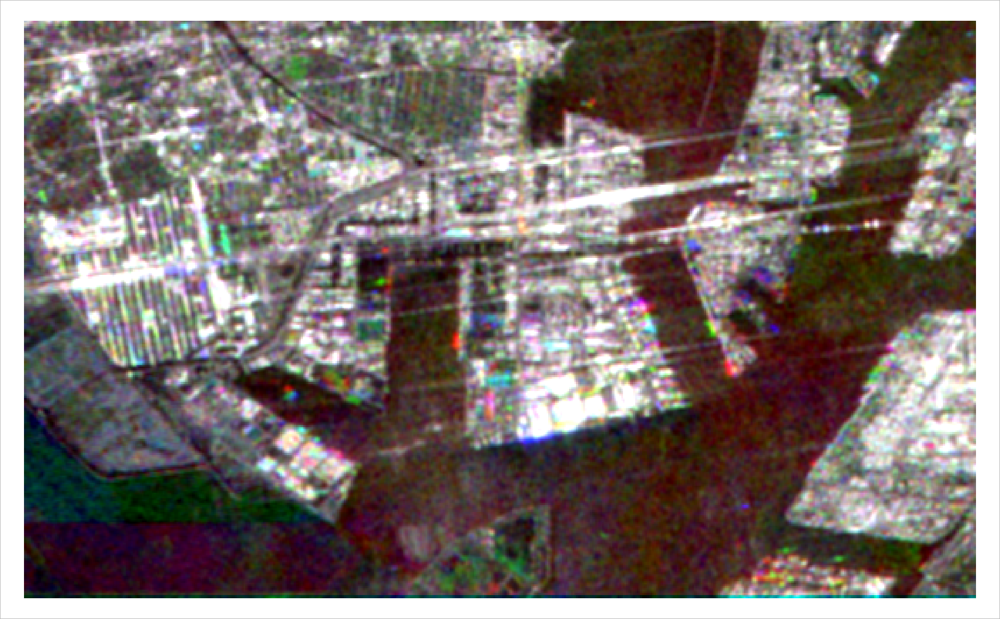

# 10.3 Composing time-series data and interpretation of ALOS data to identify changes
This section introduces participants to ......

## Content:
- 10.3.1 Creating the time-series data 
- 10.3.2 Interpreting time-series data to identify temporal changes 

## 10.3.1 Creating the time-series data 

### a. [The Complete Guide to Time Series Forecasting Models](https://medium.com/@wainaina.pierre/the-complete-guide-to-time-series-forecasting-models-ef9c8cd40037)

This website provides a comprehensive overview of Time Series Forecasting. It explains how to analyze data that changes over time, using statistical models to make predictions about future trends.

Learners wil understand the points below from this content:
1. **Time Series Data Characteristics:** Data points are ordered chronologically, and each observation is dependent on the previous one. Understanding trends, seasonality, and noise helps in analyzing the data.
2. **Importance of Stationarity:** Stationary data, where properties like mean and variance stay constant, is easier to analyze. Stationarity ensures that statistical models, such as ARIMA, perform accurately.
3. **Time Series Models:** Several models like AR, MA, ARIMA, SARIMA, and machine learning models (RNNs, LSTMs) are used to capture patterns and predict future values. Each model is suitable for different types of time series data (e.g., with or without seasonality or trends).
4. **Model Evaluation:** Metrics such as MAE, RMSE, and MAPE help in assessing the accuracy of these models. Cross-validation techniques ensure models generalize well to new data.
5. **Python vs. R:** Both languages are effective for time series forecasting. Python is more versatile, especially for machine learning, while R excels in statistical modeling and visualization.

### b. [Time-Series Analysis of Satellite Data: Unveiling Trends and Patterns](https://flypix.ai/blog/time-series-analysis-of-satellite-data-unveiling-trends-and-patterns/)

The article on time-series analysis of satellite data:
1. **Understanding Changes Over Time:** Time-series analysis of satellite imagery helps monitor and interpret changes in the Earth's surface, such as vegetation, water bodies, and infrastructure, by analyzing images captured at regular intervals over a period of time.
2. **Applications in Environmental and Urban Monitoring:** This technique is valuable for various applications like monitoring vegetation health (using indices like NDVI), detecting deforestation, assessing sea level rise, coastal erosion, and analyzing urbanization trends and land use changes.
3. **Disaster Response and Recovery:** Time-series analysis is crucial for assessing the impact of natural disasters. It helps emergency responders and policymakers allocate resources, plan recovery efforts, and make informed decisions on infrastructure rebuilding and long-term recovery.
4. **Challenges in Data Analysis:** The process faces challenges like ensuring the quality of satellite imagery, managing large datasets with high computational demands, and requiring domain expertise for accurate interpretation of trends.
5. **Future Potential and Technological Advancements:** As technology advances, time-series analysis will continue to improve, offering deeper insights into environmental and societal changes. Platforms like FlyPix AI aim to simplify and enhance this analysis, enabling organizations to make data-driven decisions.

### c. [Creating time-series data from ALOS-2 imagery]()

For this tutorial, we provide hands-on guidance on how to prepare time-series data from ALOS-2 imagery. This hands-on provided step-by-step instructions to prepare time-series data from ALOS-2 imagery in Python.

The code processes ALOS-2 satellite images by loading an Area of Interest (AOI) shapefile and a list of image paths, followed by a series of steps for each image: clipping it to the AOI, applying calibration using a logarithmic transformation, and filtering with a Lee filter. Each processed image—original clipped, calibrated, and filtered—is visualized side by side for comparison. The filtered images are resized to a common shape to ensure consistency, and they are then stacked into a multi-band GeoTIFF file. Finally, the stacked image is saved to a specified output path, allowing for further analysis of the time-series data.

- [Hands-on guidance for prepare_time-series_data_from_ALOS-2_imagery](code/10.3.Prepare_time-series_data_from_ALOS-2_imagery.ipynb)

**The guidance on how to prepare time-series data from ALOS-2 imagery**

Preparing time-series data from ALOS-2 imagery involves processing multiple images taken at different times and aligning them to analyze changes over time. Here are the detailed steps to prepare and analyze time-series data from ALOS-2 imagery:

**Step 1: Collect and Organize ALOS-2 Images**
Gather all ALOS-2 images of the area of interest (AOI) taken over the desired time period. Ensure all images have consistent polarization channels (e.g., HH, HV) and are aligned with the same projection. Organize them in a folder structure where each file represents a different timestamp.

Additional option:
Clipping to Area of Interest (AOI): You may want to clip the image to a specific geographic area using a shapefile or geoJSON.

**Step 2: Load ALOS-2 Data**
Load the ALOS-2 SAR image data into your processing environment. The data often comes in GeoTIFF format with multiple polarization bands (like HH, HV, VH, and VV). In this case, we will use the alos-2 on HH polarization.

**Step 3: Calibrate Images**

Apply Radiometric calibration factors to convert digital numbers to backscatter values. Apply the calibration formula 20*log10(band) - 83 to each band of each image. This step ensures consistency in data interpretation across time.

Radiometric calibration is crucial for converting ALOS-2 SAR data into physically meaningful values (like backscatter) that accurately represent the reflectivity of the Earth's surface. It ensures that the data is corrected for sensor biases, comparable across different sensors or acquisition times, and suitable for detailed analysis like environmental monitoring, land use classification, and disaster management.

_ADD FOMULA IMAGE_

**Step 4: Apply Speckle Filtering**
Reduce speckle noise across the time-series images to make the time-series analysis more robust. Apply a Lee filter to each calibrated band. Filtering helps to smooth out noise and is especially useful for visualizing temporal changes.

## 10.3.2 Interpreting time-series data to identify temporal changes

### Analyzing time-series data to identify changes in container operations and port activity

Stacking ALOS-2 images involves combining multiple SAR images taken over the same area but at different times into a single multi-layered file. This stacked image allows you to analyze changes over time within the area of interest (AOI).

Multi-Temporal Analysis: Each layer in the stack represents a different time point. The stacked file includes images from 2018, 2019, 2020, and 2022. By stacking these images, it can compare and analyze changes in surface properties or other factors affecting radar backscatter over time.

#### The Temporal/Spectral Profile Tool Plugin in QGIS
The Temporal/Spectral Profile Tool plugin in QGIS is a powerful tool for analyzing time-series data and observing trends or changes over time, which is particularly useful for monitoring container operations and port activity. Here’s a step-by-step guide on how to use this plugin with your ALOS-2 data:

### Interpret changes and visualize trends using graphs

