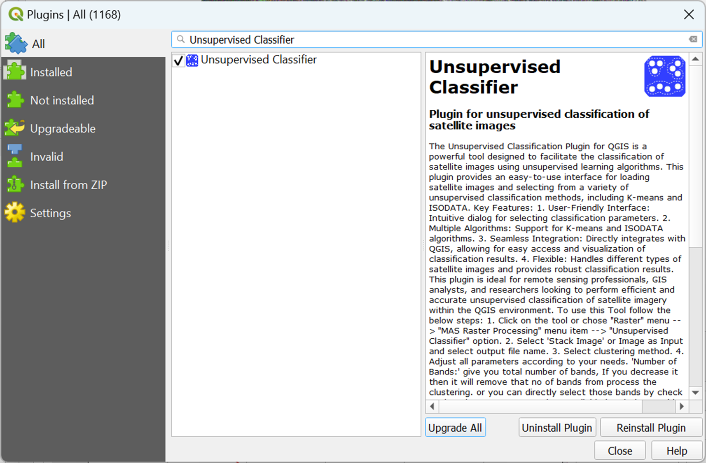
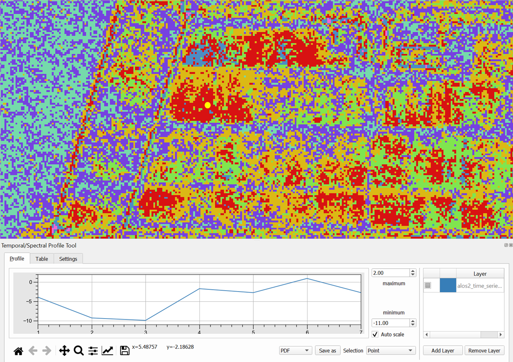

# 10.4 Analyzing the time-series data for sample location(s)/region(s)
This section introduces participants to .......

## Content:
- 10.4.1 Selecting sample location/area
- 10.4.2 Analyzing changes in sample location/area using time-series data 

## 10.4.1 Selecting sample location/area

### To choose sample locations/regions for detailed analysis

In the ALOS-2 port activity analysis, clusters might represent different areas of the port with varying activity levels (e.g., high container density vs. low-density storage areas). Selecting sample locations from each cluster ensures that you're examining areas with similar trends. To choose sample locations or regions for detailed analysis in QGIS, creating clusters before selecting sample locations in an unsupervised classification process serves several important purposes, especially when analyzing spatial data like SAR imagery or time-series data. Pixels within the same cluster are expected to follow similar trends in terms of their spectral values, temporal patterns, or changes over time. 

If your analysis goal is to track changes (e.g., container operations, industrial activity), selecting sample locations from each cluster ensures that you're analyzing areas with consistent behaviors or trends. Here's why clustering is beneficial and it relates to selecting sample locations for similar trends.

Based on clusters generated by the Unsupervised Classifier Plugin, follow these steps:

#### Install the Temporal/Spectral Profile Plugin
The Unsupervised Classifier Plugin typically groups similar pixels into clusters based on their spectral or temporal characteristics. Each cluster represents a distinct class, often with similar properties. These could be water, vegetation, infrastructure, or areas of change in our case.
- Open QGIS and navigate to the Plugins menu.
- Select Manage and Install Plugins.
- Search for “Unsupervised Classifier” and install the plugin.

#### Perform Unsupervised Classification to Create Clusters

- Load the Data and Use the Unsupervised Classifier Plugin to generate clusters based on the stacked data (The clusters will group pixels into categories based on similarities of the data characteristics). 
- Select........... ADD DETAILS

#### Visualize and Analyze the Cluster Map
After running the unsupervised classification, visualize the resulting raster in QGIS. Each pixel will be assigned a cluster label, typically shown in different colors. Each cluster represents a unique group of pixels that have similar characteristics.

#### Select Representative Sample Locations based on the clusters for Analysis

Use the "Point" or "Polygon" Tool:
- For each cluster, manually select sample locations by placing points or drawing polygons over homogeneous areas within the cluster.
- Ensure that your sample points/polygons are evenly distributed across the entire region to cover different areas within each cluster.

After selecting the sample points/polygons, save them as a new layer (shapefile or geopackage) in QGIS.

#### View the Temporal Profile of stacked layer based on the clusters

**Select the Time Series Layers**
- In the Temporal/Spectral Profile window, click the "Add" button to load the time series of rasters.
- Choose the layers that correspond to the temporal data (e.g., Value for different dates or years).
- These layers must have temporal information in their metadata or file names, which the tool uses to organize them chronologically.

**Pick a Location for Analysis**
- In the QGIS canvas, use the tool to select a point of interest (POI) where you want to analyze the changes over time.
- You can click directly on the map or manually input the coordinates.

**View the Temporal Profile**
- The Temporal/Spectral Profile tool will generate a graph that shows the change in raster values over time for the selected location.
- The X-axis represents time (e.g., date or year), and the Y-axis shows the raster values (e.g., back scatter value).

## 10.4.2 Analyzing changes in sample location/area using time-series data 

### Analyzing and visualizing sample locations

This code analyzes temporal changes in ALOS-2 backscatter data across specified areas of interest (AOIs) using a stacked time-series raster image. By masking each AOI’s geometry on the stacked raster data, it calculates the median backscatter value for each time layer. The time layers correspond to ALOS-2 images from various dates for visualization purposes. The results are then plotted, showing backscatter trends over time for each AOI, which allows for tracking changes in reflective surface properties, potentially indicating shifts in surface conditions within the AOIs.

[Analyzing and visualizing sample locations]()

